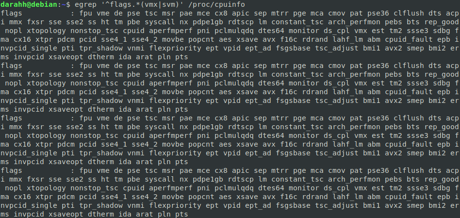
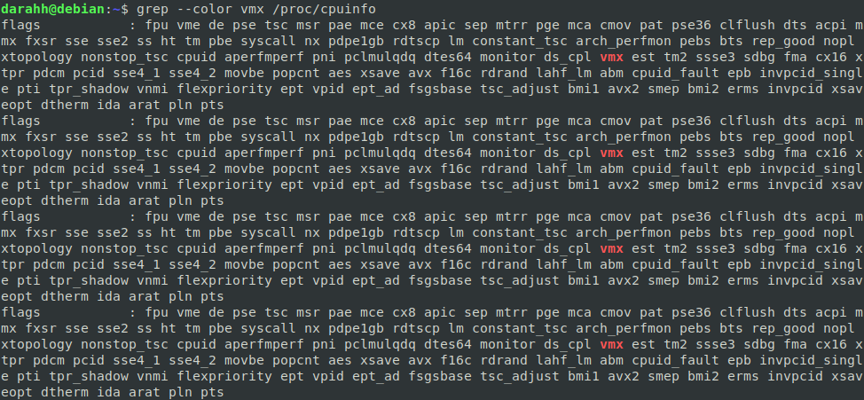
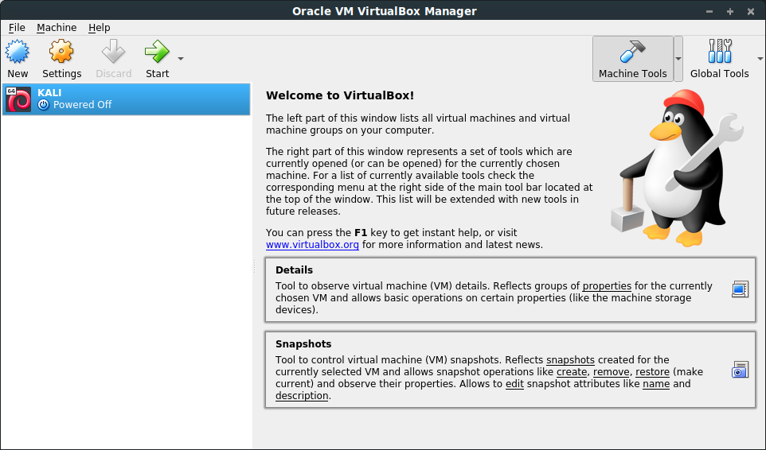

# Introducción a la infraestructura virtual: concepto y soporte físico

## Introducción

**Ejercicio 1**

Consultar en el catálogo de alguna tienda de informática el precio de un ordenador tipo servidor y calcular su coste de amortización a cuatro y siete años. [Consultar este artículo en Infoautónomos sobre el tema](http://infoautonomos.eleconomista.es/consultas-a-la-comunidad/988/).

He escogido el primer resultado que aparece en PcComponentes al buscar servidores, un HP ProLiant MicroServer Gen10, con un precio de 385€, sin iva 318'18€.

El coste de amortización a cuatro años sería 318'18€ x 0.25 = 79'545€. A 7 años sería 318'18€ x 0.142857 = 45'454€

## Tecnologías de virtualización: un poco de historia

**Ejercicio 2**

Usando las tablas de precios de servicios de alojamiento en Internet “clásicos”, es decir, que ofrezcan Virtual Private Servers o servidores físicos, y de proveedores de servicios en la nube, comparar el coste durante un año de un ordenador con un procesador estándar (escogerlo de forma que sea el mismo tipo de procesador en los dos vendedores) y con el resto de las características similares (tamaño de disco duro equivalente a transferencia de disco duro) en el caso de que la infraestructura comprada se usa solo el 1% o el 10% del tiempo.

Compararé los servicios de alojamiento de [Hostinger](https://www.hostinger.es/servidor-vps) y [DigitalOcean](https://www.digitalocean.com/pricing/).

DigitalOcean Standard:

- Memoria: 2GB
- VCPUS: 1
- Transfer: 2TB
- Almacenamiento: 50GB

Precio: $10/mes. $0.015/hr

VPS Hostinger plan 2

- Memoria: 2GB
- VCPUS: 2
- Transfer: 2TB
- Almacenamiento: 40GB

Precio: $19.95/mes

**DigitalOcean**: $10 * 12 meses = $120/año

**Hostinger**: $19.95 * 12 meses = $239.4/año

**Si se usaran un 1%:**

**DigitalOcean** 1.2€/año

**Hostinger** 2.394€/año

**Si se usaran un 10%:**

**DigitalOcean** 12.0€/año

**Hostinger** 23.94€/año

## Virtualización a nivel de hardware

**Ejercicio 3**

En general, cualquier ordenador con menos de 5 o 6 años tendrá estos flags. ¿Qué modelo de procesador es? ¿Qué aparece como salida de esa orden? Si usas una máquina virtual, ¿qué resultado da? ¿Y en una Raspberry Pi o, si tienes acceso, [el procesador del móvil](https://stackoverflow.com/questions/26239956/how-to-get-specific-information-of-an-android-device-from-proc-cpuinfo-file)?

El modelo de procesador es: Intel© Core™ i7-4510U CPU @ 2.00GHz × 2.

La salida del comando `egrep '^flags.*(vmx|svm)' /proc/cpuinfo`

Una máquina virtual con sistema operativo Kali Linux muestra las siguientes flags:

`flags		: fpu vme de pse tsc msr pae mce cx8 apic sep mtrr pge mca cmov pat pse36 clflush mmx fxsr sse sse2 syscall nx rdtscp lm constant_tsc rep_good nopl xtopology nonstop_tsc cpuid tsc_known_freq pni pclmulqdq monitor ssse3 cx16 pcid sse4_1 sse4_2 x2apic movbe popcnt aes xsave avx rdrand hypervisor lahf_lm abm invpcid_single pti fsgsbase avx2 invpcid`

**Ejercicios 4**

1. Comprobar si el núcleo instalado en tu ordenador contiene este módulo del kernel usando la orden kvm-ok. Alternativamente (o además), usar lscpu como se indica arriba.

  No dispongo de la orden `kvm-ok` asi que para comprobar si el procesador (en mi caso Intel) soporta virtualización por kernel he usado la siguiente orden: `grep --color vmx /proc/cpuinfo`.

  

  Alternativamente, se podía usar perfectamente el comando `lscpu`.

2. Instalar un hipervisor para gestionar máquinas virtuales, que más adelante se podrá usar en pruebas y ejercicios.

  Tengo instalado Oracle VirtualBox, ya que lo hemos usado en varias asignaturas.

  

## Niveles y tipos de infraestructura virtual

**Ejercicio 5**

Darse de alta en servicios de nube usando ofertas gratuitas o cupones que pueda proporcionar el profesor.

Me he registrado en Microsoft Azure con el cupón que proporciona el plan de estudiante de Github.

He elegido Microsoft Azure porque permite registrarse sin asociar una tarjeta de crédito a la cuenta, al contrario de lo que sucede con DigitalOcean, que había sido mi elección en un comienzo.
